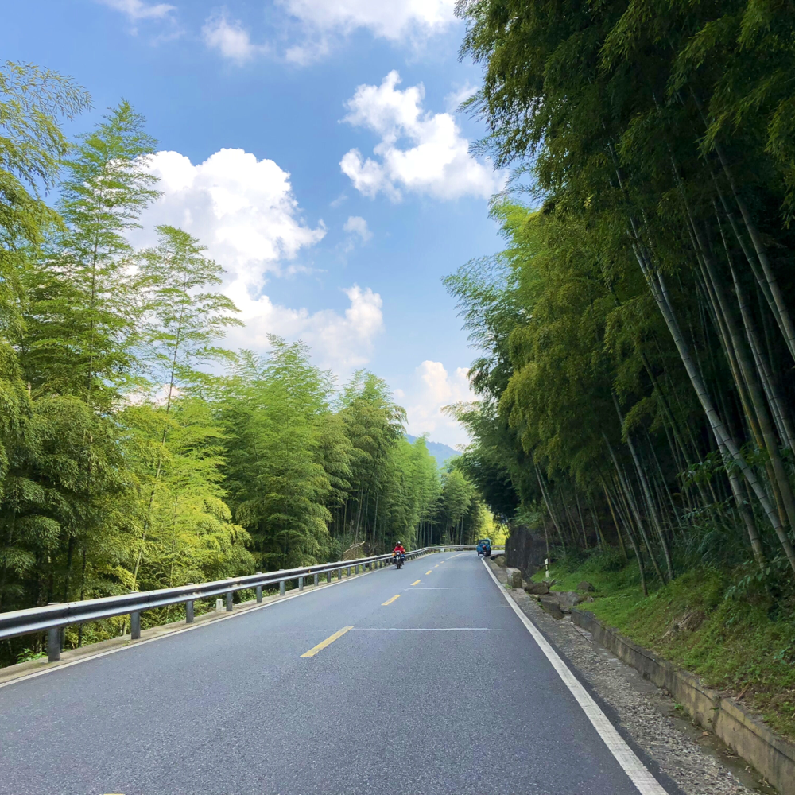

# Resize Image 


Create the UIImage category, use the Core Graphics to resize the UIImage in Objective-C

## How to use

origin:


### Scale fill to 1000 X 1000

```
 UIImage *scaleFillImage =  
 [sourceImage resize:CGSizeMake(1000, 1000)];
 
```


### Aspect fit to 1000 * 1000, and fill red color. Default fill color is black, default mode is AspectFit

```
UIImage *aspectFitImage =  
[sourceImage resize:CGSizeMake(1000, 1000) 
fillColor:UIColor.redColor 
mode:ImageResizeModeAspectFit];
 
```


### Aspect fill to 1000 x 1000

```
   UIImage *aspectFillImage =
   [sourceImage
   resize:CGSizeMake(1000, 1000)
   fillColor:UIColor.clearColor
   mode:ImageResizeModeAspectFill];
```



